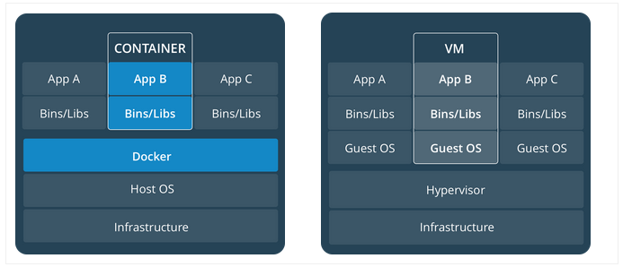

Docker has taken the world over by storm (or at least, taken over my world, the rest of the world realized its importance a while back). But what exactly is Docker? I recently got a chance to learn Docker on my own. This post documents my experience on what I learned and is bird's eye view on the Container technology for those who do not have the faintest idea of what that is (just like me, when I started). This post aims to give readers an idea of what Docker is (I hope), and will act as a building block to learn further. We will also learn about container orchestration systems which manage containers on the server, and explore one such system, Cycle. 

## What is Docker

Docker is an open-source software that helps us run other software by enfolding and bundling the whole thing in **Containers**. Containers are self-contained units of software, with all their dependencies included within the package. If you take a look at Docker's [logo](https://blog.docker.com/2013/06/announcing-new-docker-style/), it is a whale carrying shipping containers, and that perfectly depicts how Docker works. It transforms all your project files, folders, and other stuff into a "shipping container", a self-sufficient unit of software carrying with it everything that it needs to run. An app may be divided into multiple such containers, and they can all run in tandem on a server, choreographed by a container orchestration system.


So it is sort of like a plug-and-play system, we just download a "box", plug it into Docker, and off it runs, without a care in the world what operating system our computer has, or whether any dependency (or variations of same dependency) is installed on our system at all. Similarly, we can pack our next app in a container, ship it to a friend, and all we need to worry about whether our friend will be able to run the app or not is whether they have Docker itself installed on their system. Whatever the operating system might be, Windows, Mac or Linux, a Docker container can run inside of it without any hiccups, even if that container was assembled in either of Windows, Linux or Mac. All that is needed is the Docker software itself installed on our systems.

Technically, Docker does not make Containers out of our projects directly, it makes **Images**, and as the name might suggest, Images are what Docker **Containers** come out of. You download an Image, make a Container out of it, and run your app as that container. There are thousands of Images on [Docker Hub](https://hub.docker.com/), a central repository for docker Images. 

## What was there before Docker?

The standard has been to use Virtual Machines (a computer inside a computer, with an operating system of its own) to run applications. Virtual Machines provide isolation for the software run inside them, at the cost of computational power and hardware resources required to run a full-blown operating system inside another. A few Virtual Machines running on a system is a huge resource hog for that system. Docker takes a different approach, they create virtual isolation for our apps, and, unlike VMs, provides an app with just enough resources it needs to run in isolation. The figure below, taken from the official Docker [guide](https://docs.docker.com/get-started/), perfectly sums all this up.



## How to Dockerize a project

Building an app using Docker can be summarized as below

1. Create a `Dockerfile` in the root of the project
2. Create Image(s) using `docker build ...`
3. Run Containers from those Images using `docker run ...`
4. Combine those containers in an app, and run them together through a `docker-compose.yml` file.

Let's explore these steps further.

Docker Images are built by giving the Docker software various instructions in a file in the root of our project, called `Dockerfile`. A sample Docker file might look like this

```
FROM node:11.14 as builder
WORKDIR /app
COPY package.json /app
RUN npm install
COPY . /app
RUN npm run build

FROM node:11.14
COPY /.env ./ 
COPY --from=builder /app/dist/ ./dist
COPY --from=builder /app/server/ ./server
COPY /packageJson_server/package.json ./
RUN npm install
ENV SECRET="abcdefg"
EXPOSE 8080
CMD [ "npm", "run", "serve" ]
```

The commands in a `Dockerfile` are just instructions to the Docker software on what it needs to do inside a project folder (many of them are self-explanatory, in fact), and they come into play once Docker is instructed, from the command-line, to start building an Image out of our project. These command-line instructions to build and run Images are written like `docker build --tag=note-taking-app .`, for example. There are a plethora of such commands, which may seem daunting at first, but once we start building a few containers, they become second nature. Most useful and oft-used commands are `docker build ...` `docker run ...`, `docker ps` `docker image ps` `docker image ls`, etc. 

When Docker sees a `Dockerfile`, it starts executing the commands one by one. It usually takes some time the first time an Image is generated from a `Dockerfile`, but after that, Docker is smart enough to cache the build, and on subsequent builds it reads the dependency list from the manifest files (`package.json` or `requirements.txt`), and if unchanged, just uses the cached version of those dependencies. 

Another feature is the **multi-stage builds**, in which *artifacts* from the first build (folders that will not be used in production, like `node_modules` folder) are discarded in the next stage of the build, thus keeping the builds lean and clean. So, in the `Dockerfile` pasted above, I first build the front-end of the application (`npm run build`), and then in the next stage, only copy over the build (`dist/`) folder, thus leaving the front-end `node_modules` behind, which will not be included in the final build. Thus the container becomes as lightweight as it can possibly be, consisting of only those files needed at runtime.

Once an Image is built, we can make as many containers out of them as we please, by running the command `docker run (Name/ID of Image) (params)` (we can provide various parameters, which are not relevant to this post).

Multiple containers can be run simultaneously using a `docker-compose.yml` file. Certain conditions may be specified in the `docker-compose.yml` file, conditions like which container should start first, how containers communicate to each other and to the outside world, what folders (volumes) those containers are allowed to access, etc. A sample `docker-compose.yml` file looks like this:

```
version: '3'
services: 
  db:
    image: 'alinisarahmed/note-app:my-mongo'
    ports:
      - "27017:27017"
    volumes:
      - /data/db:/data/db
  nodejs:
    build: .
    image: 'alinisarahmed/note-app:v2'
    command: npm run serve
    ports: 
      - "3000:3000"
    depends_on:
      - db
    links:
      - db
    environment: 
      - MONGO_HOSTNAME=mongodb://db:27017/test-db
      - PORT=3000
```


## Advantages of Docker

So, What's the point of doing all this "Containerization", you ask? Running applications as containers have many benefits, as summarized below:

  - Containerization provides an abstraction from the environments in which apps are made and run. This decoupling engenders consistency, standardization, and parity, and allows developers to create predictable environments for their apps to run anywhere. Developers can focus on the code without worrying about the system that it will ultimately be running on.
  - It helps us avoid dependency issues such as clashes between dependencies, dependency variations between systems, or situations like one program altering the version of a dependency, which renders another program useless.
  - It takes the "Module" model of software development to the level of app deployment, we can utilize Images that other people have made and integrate them seamlessly into your own apps, without any worry.
  - Docker manages to reduce deployment to seconds (provided you use a good container orchestrator, more on this later). This is due to the fact that it creates a container for every process and does not boot an OS.
  - Docker enables easy version control of the production builds, making it easy to rollback to a previous working image of the production build.
  - Docker ensures apps can be removed cleanly from a system, since, once an app container is deleted, all its associated dependencies are gone from our system as well without leaving any temporary or configuration files on the host OS. 
  - Docker also ensures that each application only uses resources that have been assigned to them.
  - Last, but not the least, another benefit of using Docker is security. From a security point of view, Docker ensures that applications that are running on containers are completely segregated. No Docker container can look into processes running inside another container.

## Deployment, Container Orchestration, and Cycle

So, we have our app containerized, how do we deploy it?

One way to deploy containers is to deploy them on a cloud server (a computer running on, well, cloud), monitored by a Container orchestration system. One of the best-known container orchestration systems is [Kubernetes](https://kubernetes.io/), another is [Cycle](https://cycle.io). We will not be comparing these systems here, but the ease with which I was able to set up a server and deploy my app (consisting of two containers, one for MongoDB and another for Node/Express JSON API and a React/TypeScript Front-end), without knowing jack about orchestrators, clouds, servers, and other dev-ops paraphernalia is a testament to Cycle's claim that a developer can now do what used to take an entire dev-ops team (heck I'm not even a professional developer yet!). You have to try it to believe it, and if you do want to try it, read on.

Cycle claims to be a container orchestration system that promises to deliver, easing the process of container management for us by letting us focus solely on the code, and not on infrastructure. User the hood, CycleOS utilizes a runtime which implements the [**Open Container Initiative**](https://www.opencontainers.org/) spec, allowing Cycle to support a variety of container technologies. Cycle offers us a **GUI Dashboard**, from where one can easily control how the containers are grouped and deployed. It currently partners with Vultr and Packet, both cloud service providers, a company that provides **Infrastructure** to host our containers. There is also a feature in pipeline where users will be able to connect their own infrastructure to the Cycle dashboard. If more fine-grained control is needed, Cycle also offers a REST-based API. 

Signing up and setting up a server with Vultr was a breeze, and the same was the case for Cycle. These services are not free, but, Vultr provides free credit for benign acts like following them on twitter, and Cycle provides $25 credits for the first month. That is enough juice to try out these services and get our feet wet.

Deploying a server, and then deploying an app through Cycle on that server, proved to be a really painless task. Rather than setting up everything from a command-line, we work from inside the GUI Dashboard. This is how the whole process goes: 

1. Select a Cloud service provider, (currently Vultr and Packet, soon AWS will be available too). 
2. Select a server size (called Infrastructure), based on your needs and budget.
3. Upload Docker Images from a repository like Docker Hub.
4. Make **Stacks** out of Docker Images (a stack is a group of images; it is an atomic unit, a bit like Images themselves), specified by a `cycle.json` file, called a stack file (more on this below).
5. Deploy the Stacks to an **Environment**, which automatically builds a private, encrypted network on which the containers communicate, and starts other services.

The only challenging aspect of the whole process for me was the creation of `cycle.json` file, however, previous experience with how `docker-compse.yml` file helped here, since `cycle.json` is basically a JSON version of the `docker-compose.yml` file, with some added options specific to Cycle. In the future, users will be able to generate `cycle.json` file automatically from a `docker-compose.yml` file.

Once an Environment is created, we are led to the full real-time GUI dashboard, which looks like this


From the dashboard, one can easily start, stop or scale containers as they wish. Have an updated Image for one of your containers? That is just a few clicks away and can be done effortlessly right on the dashboard. Worried that an update might crash your whole app? Cycle has the capability to automatically fall-back to last known working configuration in case of failure. Each Environment also comes with services like VPN (Virtual Private Network), Load Balancer, and Discovery (a DNS service), which are containers themselves. In the future, users will be able to provide their own "services" containers and thus gain more even more control over how their Environment behaves.

Overall, it really was a delightful experience seeing my simple two-container app deployed so quickly. I'm sure that as the number of containers increase and complexity of an application grows, Cycle is THE platform you need to manage the whole system. Read more about this technology on their [documentation](https://docs.cycle.io/) page.

## Further Resources

If you want to learn more about the container technology, following links helped me tremendously.

- [One of the best resources out there](https://docker-curriculum.com/)
- [The Official Docker guide](https://docs.docker.com/get-started/)
- [This great medium post which goes into a lot more detail](https://medium.freecodecamp.org/docker-simplified-96639a35ff36)
- [This awesome 2-part video series on Docker](https://youtu.be/pGYAg7TMmp0)
- [How to run a React App in a Docker Container](https://dev.to/peterj/run-a-react-app-in-a-docker-container-kjn)
- [Another great tutorial, from Digital Ocean](https://www.digitalocean.com/community/tutorials/how-to-build-a-node-js-application-with-docker)

---